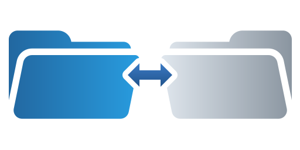

# Replicator

## Description
Replicator is a cross-platform Python application designed to provide replication services similar to Windows DFSR. It supports local filesystems and SMB making it a versatile solution for data replication needs across different operating systems.

## Features
  - **Cross-Platform Compatibility**: Replicator is compatible with Windows, macOS and Linux, with specific adjustments made to ensure seamless operation on both operating systems.
  - **SMB Support**: The application can replicate data to and from SMB shares, making it suitable for networked environments.
  - **Configurable Replication Modes**: Users can choose between different replication modes (e.g., Mirror, Incremental) to suit their specific needs.
  - **Scheduling**: Replication tasks can be scheduled to run at specific times or intervals, allowing for automated data synchronization.
  - **Conflict Resolution**: The application includes strategies for resolving conflicts that may arise during replication, ensuring data integrity and consistency.
  - **Service Integration**: Replicator can be integrated with system services to run in the background, providing continuous replication without user intervention.
  - **Logging and Debugging**: The application includes logging features for easier debugging and tracking of issues during the replication process.

## License
This software is distributed under the [GPLv3](LICENSE) license.

## Security
Please disclose any vulnerabilities found responsibly – report security issues to the maintainers privately. See [SECURITY.md](SECURITY.md) for more information.

## Contributing
Contributions to Replicator are welcome! If you have ideas for new features or have found bugs, please open an issue or submit a pull request.

### How to Contribute
  - **Fork the Repository**: Create a fork of the repository on GitHub.
  - **Create a New Branch**: For new features or bug fixes, create a new branch in your fork.
  - **Submit a Pull Request**: Once your changes are ready, submit a pull request to the main repository.

## To Do
  - ~~**Support for Local**: Add support for Local filesystems.~~
  - ~~**Support for SMB**: Add support for SMB Shares.~~
  - ~~**Support for FTP**: Add support for FTP Shares.~~ --- REMOVED ---
  - ~~**Support for SSHFS**: Add support for SSH filesystems.~~ --- REMOVED ---
  - ~~**Mode Mirror**: Add replication mode Mirror.~~
  - **Mode Incremental**: Add replication mode Incremental.
  - ~~**Direction**: Add replication direction (One way, Two way).~~
  - ~~**Scheduling**: Add scheduling capabilities for replication tasks.~~
  - ~~**Conflict Resolution**: Implement conflict resolution strategies for file changes.~~
  - ~~**Service Integration**: Integrate with system services for background operation.~~

## Wait, where is the documentation?
Review the [Documentation](https://laswitchtech.com/en/blog/projects/replicator/index).
